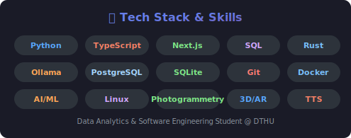
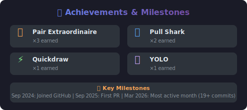
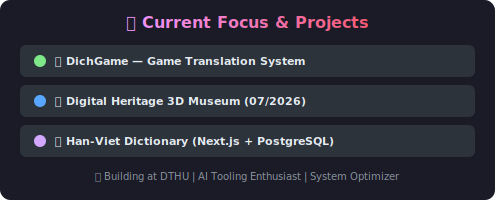
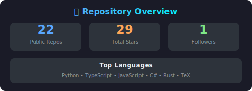

# Hi there, I'm Doan Minh Tri (MinhTriTM) 👋

**Data Analytics & Software Engineering Student | AI Tooling Enthusiast | System Optimizer | Arch Linux Enthusiast**

Tôi là **Đoàn Minh Trí**, hiện là sinh viên ngành Công nghệ Thông tin tại Trường Đại học Đồng Tháp (DTHU). Tư duy lập trình của tôi được định hình bởi sự kết hợp giữa kiến trúc phần mềm hiện đại, tự động hóa hạ tầng và tối ưu hóa hiệu năng phần cứng ở cấp độ chuyên sâu. Không dừng lại ở việc viết mã, tôi tập trung vào cách hệ thống vận hành, từ lớp keo tản nhiệt trên CPU cho đến cấu trúc Microservices trên Cloud.

Bên cạnh công việc kỹ thuật, tôi cũng tích cực tham gia các hoạt động phong trào với vai trò **Ủy viên Ban chấp hành Đoàn/Hội** Khoa Công nghệ và Kỹ thuật tại DTHU.

**📊 GitHub:** [](https://github.com/MinhTriTM?tab=repositories)   [](https://github.com/MinhTriTM)

> 🏆 **Achievements:** Pair Extraordinaire ×3 · Pull Shark ×2 · Quickdraw · YOLO

---

## 🛠️ Technical Ecosystem & Core Competencies

### 🤖 Artificial Intelligence & Software Development
*   **AI-First Workflows:** Khai thác chuyên sâu các IDE thế hệ mới như **Claude** và **Google Antigravity** để tối ưu hóa tốc độ đóng gói source code.
*   **Local AI Deployment:** Cấu hình và triển khai các mô hình ngôn ngữ lớn (LLMs) và mô hình tạo ảnh cục bộ thông qua **Ollama** và **Stable Diffusion**, xây dựng các AI Agents độc lập không phụ thuộc vào API đám mây.
*   **Core Languages & Tools:** Thành thạo **Python**, nắm vững cấu trúc dữ liệu và thuật toán, tư duy tối ưu hóa truy vấn **SQL**, cùng khả năng xử lý, phân tích dữ liệu nâng cao trên các công cụ chuyên dụng.

### 🖧 Systems Administration & Infrastructure
*   **Game Server Architecture:** Thiết kế, vận hành và tối ưu hóa các máy chủ **Minecraft Modded (ATM10 Modpacks)** hiệu năng cao.
*   **Automation:** Viết CLI Scripts để quản lý phân quyền hệ thống (Server Permissions), tối ưu hóa tài nguyên RAM/CPU và tự động hóa tác vụ sao lưu.
*   **Data Recovery:** Khả năng phân tích cấu trúc phân vùng và cứu hộ dữ liệu chuyên sâu trên nhiều loại phương tiện lưu trữ vật lý như **SD Cards**, **KIOXIA SSDs**, và **Seagate HDDs**.

### 💻 Hardware & Thermal Engineering
*   **Thermal Management:** Nghiên cứu và ứng dụng thực tế các giải pháp tản nhiệt cao cấp cho các dòng máy cấu hình cao (Alienware, Precision).
*   **Advanced Modification:** Làm chủ kỹ thuật phủ cách điện vật lý (**Conformal Coating**) và áp dụng các chất dẫn nhiệt tiên tiến như **Liquid Metal** (Kim loại lỏng) và **Dell Element 31** để kiểm soát chu kỳ nhiệt của phần cứng dưới tải nặng.
*   **Operating Systems:** Sử dụng chuyên sâu **Arch Linux** và **Ubuntu** (Dual-boot, quản lý fstab).

### 🎨 Creative Multimedia & 3D Modeling
*   **Post-Production:** Thành thạo bộ công cụ Adobe (**Photoshop** - nâng cao kỹ thuật tách nền/làm nét, **After Effects** - Motion Graphics) và **DaVinci Resolve** để sản xuất video chuyên nghiệp.
*   **CAD/3D Design:** Sử dụng **Autodesk Inventor** để mô phỏng và thiết kế kỹ thuật.
*   **3D Digitization:** Ứng dụng công nghệ Photogrammetry (RealityCapture, Polycam) kết hợp cảm biến thiết bị di động (Note 20 Ultra) để số hóa mô hình 3D cổ vật.

---

## 🚀 Featured Projects & Research

### 1. 🌐 DichGame — Game Translation System `E:\DichGame`
> Hệ thống dịch thuật game tự động từ tiếng Trung → Việt, kiến trúc pipeline 3 bước.
*   **Architecture:** Pipeline 3 steps: Extract → Translate → Merge
*   **Core Tech:** Python, SQLite, Ollama (Local LLM), Next.js Web Dashboard
*   **Key Features:**
    *   Dashboard quản lý trạng thái dịch thuật real-time
    *   AI model dịch chuyên biệt cho ngữ cảnh game (thuật ngữ, tên vật phẩm, hội thoại NPC)
    *   Batch processing & queue management cho hàng nghìn chuỗi text
    *   Tích hợp AI models local hoàn toàn qua Ollama — không phụ thuộc cloud API
    *   Export training data để fine-tune model dịch thuật
*   **Scale:** Xử lý hàng nghìn bản ghi CSV/JSON từ assets game, phân tích NSFW, quản lý trạng thái pending/approved

### 2. 🏛️ Digital Heritage 3D Museum (Di sản số) `D:\Du_An_Mini\Di_San_So`
> Dự án nghiên cứu hợp tác cùng thầy Quốc Anh — Ứng dụng 3D/AR/VR để trực quan hóa lịch sử.
*   **Focus:** EdTech / 3D Reconstruction / Photogrammetry
*   **Core Tech:** RealityCapture, Polycam, Kinect + Note 20 Ultra sensors
*   **Description:** Biến kiến thức lịch sử, địa lý, nghệ thuật khô khan thành trải nghiệm học tập sống động, nhập vai cho học sinh.
*   **Timeline:** Dự kiến ra mắt bản web demo + mô hình 3D vào **07/2026**

### 3. 📖 Han-Viet Dictionary (Từ điển Hán-Việt) `D:\Han_Viet`
> Ứng dụng web tra cứu từ điển Hán-Việt chuyên sâu, kế thừa dữ liệu từ CVDICT & KanjiDictVN.
*   **Tech Stack:** Next.js, TypeScript, PostgreSQL, pnpm
*   **Data Sources:** CVDICT.u8, KanjiDictVN, TudienThienChuu
*   **Features:** Tìm kiếm Hán tự, tra cứu nghĩa, giao diện Material Design responsive

### 4. 🏛️ Heritage Management System (HDMS) v2.5
*   **Focus:** Database & UI Design
*   **Description:** Hệ thống quản lý cơ sở dữ liệu di sản — Material Design 3, Soft Delete, tối ưu hóa luồng dữ liệu quản lý cổ vật.
*   **Related:** `E:\LAP_TRINH_PYTHON_VA_UNG_DUNG\di_san_QG.db` — SQLite database di sản quốc gia

### 5. ☀️ Solar Energy Data Analytics & Grid Optimization
*   **Focus:** Data Analytics & Grid Integration
*   **Description:** Xử lý & phân tích tập dữ liệu sản lượng (MWh) thực tế dự án năng lượng mặt trời 2024–2025. Nghiên cứu sơ đồ định tuyến kỹ thuật chuẩn xác để kết nối dòng điện vào lưới điện quốc gia.

### 6. 🤖 Context-Aware Chinese-to-Vietnamese Translation System
*   **Architecture:** Microservices (async inter-service communication)
*   **Core Tech:** Ollama Local LLMs, Python
*   **Description:** Hệ thống dịch thuật nhận biết ngữ cảnh sâu, xử lý bất đồng bộ giữa các microservices để tối ưu hóa latency và accuracy.

### 7. 🏗️ Maze Crawler — AI Contest Agent `E:\Maze_Crawler`
> Dự án thi đấu giải mê cung sử dụng AI agents tự học.
*   **Tech Stack:** Python, AI Evolution Algorithms
*   **Features:** GUI visualization maze real-time, training & evolution pipeline, contest submission system
*   **Files:** `main.py`, `gui_server.py`, `visualize_training.py`, `TRAINING_GUIDE.md`

### 8. 🌍 Zero-shot Cross-lingual Retrieval `E:\Zero-shot Cross-lingual Retrieval without Parallel Machine Translation`
> Nghiên cứu hệ thống truy xuất đa ngôn ngữ không cần dữ liệu dịch song song (zero-shot).
*   **Tech Stack:** Python, NLP, Machine Learning
*   **Components:** CLI app, retrieval engine, training pipeline, config management

### 9. 🔊 TTS Nano — Text-to-Speech `E:\TTS_nano`
> Dự án Text-to-Speech sử dụng mô hình nano, training local.
*   **Tech Stack:** Python, AI/ML
*   **Structure:** Training pipeline, cleanup scripts

### 10. 🍄 Mushroom Disease Detection (Deep Learning) `D:\Du_An_Mini\Mushroom_Disease_Detection_using_Deep-Learning`
> Nhận diện bệnh nấm bằng Deep Learning — ứng dụng Computer Vision trong nông nghiệp.

### 11. 🎮 Valheim Modding Suite `E:\Valheim_Mod`
> Modding game Valheim với BepInEx framework cho server custom gameplay.
*   **Tech Stack:** BepInEx, Unity, C#
*   **Features:** Server mods, custom gameplay enhancements, BepInEx doorstop config

---

## ⭐ Pinned Repositories

| Repository | Description | Tech |
|:---|:---|:---|
| [**Universal-Unity-IL2CPP-Save-Engine**](https://github.com/MinhTriTM/Universal-Unity-IL2CPP-Save-Engine) | Universal save system for Unity IL2CPP builds | Python |
| [**Git_Easy_Toolkit**](https://github.com/MinhTriTM/Git_Easy_Toolkit) | Git automation & CLI toolkit | Python |
| [**Universal_Translation_Hub_-UTH-**](https://github.com/MinhTriTM/Universal_Translation_Hub_-UTH-) | Universal translation hub — multi-engine aggregation | Python |
| [**IMO-AXON**](https://github.com/MinhTriTM/IMO-AXON) | IMO-AXON AI system | Python |

---

## 📦 All Repositories (53 total)

### 🔵 Public Repos
| Repository | Language | Last Updated |
|:---|:---|:---|
| [Laptop-Web](https://github.com/MinhTriTM/Laptop-Web) | — | Jun 2025 |
| [My-Web-CV](https://github.com/MinhTriTM/My-Web-CV) | CSS | May 2025 |

### 🔒 Private Repos (by category)

**🤖 AI / ML / NLP**
| Repo | Language | Updated |
|:---|:---|:---|
| NMS_Translation_Tool | Python | Feb 2026 |
| Face-Swap-Inference | — | Jun 2025 |

**🎮 Game Dev / Modding**
| Repo | Language | Updated |
|:---|:---|:---|
| NRO_SIEU_THAN_Beta | Java | Sep 2025 |
| NRO_SIEU_THAN_Beta_No_PNG | Java | Sep 2025 |
| studio-minigame | TypeScript | Sep 2025 |
| mini-game | — | Sep 2025 |
| waifu_of_god-1.0.0-forge-1.20.1 | — | Jun 2025 |

**🌐 Web Development / E-Commerce**
| Repo | Language | Updated |
|:---|:---|:---|
| demo_web_laptop_pc | — | Mar 2026 |
| LaptopWeb | JavaScript | Jun 2025 |
| all-laptop | TypeScript | Jun 2025 |
| studio | TypeScript | Jun 2025 |
| ttb-store-project | JavaScript | Jun 2025 |
| Ecommerce-Fe | JavaScript | Jun 2025 |
| cnpm-shopping_tienkim9920 | JavaScript | Jun 2025 |
| Electronics-eCommerce-Shop-...-NextJS-NodeJS-A1 | TypeScript | Jun 2025 |

**📚 Education / Academic**
| Repo | Language | Updated |
|:---|:---|:---|
| BTL_LTHDT | TypeScript | Dec 2025 |
| BTL_TTNT | Python | Mar 2026 |
| BTL_Py_2.0 | Python | Mar 2026 |
| NHAP_MON_TRI_TUE_NHAN_TAO | Python | Mar 2026 |
| LAP_TRINH_PYTHON_VA_UNG_DUNG | JavaScript/Python | Mar 2026 |
| LTCB | C | Feb 2025 |
| LMS-my-moodle-mirror | PHP | Sep 2025 |

**🛠️ Tools / Infra / SaaS**
| Repo | Language | Updated |
|:---|:---|:---|
| WCC_Core_v1 | Rust | Jan 2026 |
| Check-In_SaaS_v1.0.1 | TypeScript | Dec 2025 |
| CheckIn | HTML | Jan 2026 |
| Bolt.AI | — | May 2025 |
| VH------V0.628-PC | — | Mar 2026 |

**🎨 Web Design / Portfolio**
| Repo | Language | Updated |
|:---|:---|:---|
| MinhTri_WebKhoa | TypeScript | May 2025 |
| Profile | — | Dec 2024 |
| Di_San_So | TeX | Feb 2026 |

---

## 📅 Contribution Timeline (Sep 2024 — Jun 2026)

```
2024 ━━━━━━━━━━━━━━━━━━━━━━━━━━━━━━━━━━━━━━━━━━━━━━━━━━━━━━━━━━━━━━━━
Sep  ██████████  Joined GitHub!
Oct  ███         First repo: LTCB (Private)
Nov  ░
Dec  ██          Profile repo

2025 ━━━━━━━━━━━━━━━━━━━━━━━━━━━━━━━━━━━━━━━━━━━━━━━━━━━━━━━━━━━━━━━━
Jan  ░
Feb  ██          LTCB
Mar  ░
Apr  ░
May  ██████████████████████  My-Web-CV (10), MinhTri_WebKhoa (5), Bolt.AI
Jun  ░
Jul  ░
Aug  ░
Sep  ██████████████████████  NRO_SIEU_THAN_Beta (8), studio-minigame (3),
                             LMS-my-moodle-mirror — First PR! 🎉
Oct  ░
Nov  ░
Dec  ██████████   Check-In_SaaS_v1.0.1 (2), BTL_LTHDT (PR)

2026 ━━━━━━━━━━━━━━━━━━━━━━━━━━━━━━━━━━━━━━━━━━━━━━━━━━━━━━━━━━━━━━━━
Jan  ██           WCC_Core_v1 (Rust)
Feb  ████         NMS_Translation_Tool, Di_San_So
Mar  ██████████████████████████████████  Most active month!
                 demo_web_laptop_pc (8), LAP_TRINH_PYTHON (6),
                 Check-In_SaaS (5), NHAP_MON_TTNT, BTL_TTNT, BTL_Py_2.0
Apr  ████         BTL_LTHDT PR (+18 −10, 7 comments) — performance fix
May  ████████     PR to giahung25/quiz_web (+32,222 lines, 6 comments)
Jun  ░            ← Current month
```

### 🏆 Key Milestones
| Date | Milestone |
|:---|:---|
| Sep 2024 | Joined GitHub |
| Oct 2024 | Created first repository (LTCB) |
| Sep 2025 | First Pull Request opened (studio-minigame) |
| Sep 2025 | First external contribution (LMS-my-moodle-mirror, PHP) |
| Mar 2026 | Most active month — 19+ commits across 6 repos |
| May 2026 | Largest PR: +32,222 lines (quiz_web) |

---

## ⚡ Góc nhỏ thú vị (Fun Facts)
*   🎧 **Audiophile & Hardware Geek:** Đam mê tối ưu hóa phần cứng và âm thanh. Việc tự thiết lập dàn loa Microlab FC730 5.1 analog qua cổng kết nối ngoại vi trên chiếc laptop gaming Dell Alienware x14 R2 là một trong những trải nghiệm thú vị nhất của tôi.
*   🧠 **Deep Learning Mind Map:** Từng tự xây dựng cấu trúc dữ liệu JSON phân cấp sâu (9 tầng) để tự động hóa và trực quan hóa bản đồ tư duy môn Lịch sử phục vụ ôn tập chuyên sâu từ năm 1858 đến nay.

---

## 📈 GitHub Statistics & Activity

| **Operating System** | **Primary IDEs** | **Hardware Lab Focus** |
| :--- | :--- | :--- |
| Windows / Arch Linux / Ubuntu | Cursor / Antigravity / VS Code | Element 31 & Liquid Metal Application |

<br>

<p align="center">
  
  
</p>

<p align="center">
  
</p>

<p align="center">
  
</p>

### 📊 Hoạt động chi tiết




### 🎯 GitHub Stats & Achievements





### 📈 Contribution Activity


### 🐍 Contribution Snake


---

## 🎨 Custom Profile Cards

### 🛠️ Tech Stack & Skills



### 🏆 Achievements & Milestones



### 🎯 Current Focus & Projects



### 📊 Repository Overview



---

## 📄 License

This project is licensed under the **MIT License** - see the [LICENSE](LICENSE) file for details.


---

⭐️ *Cảm ơn bạn đã ghé thăm profile của tôi! Rất vui được kết nối và giao lưu với cộng đồng đam mê công nghệ.*
