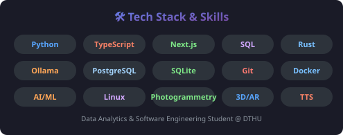
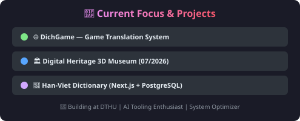

# Hi, I'm MinhTriTM 👋

**IT Student | Data & Software Enthusiast | AI Automation Learner**

Mình tập trung vào học và xây dựng các dự án thực tế xoay quanh:
- Python, TypeScript, SQL
- Data processing & automation
- AI tooling và workflow tối ưu
- Web app development

---

## 🚀 Featured repositories

- [Universal-Unity-IL2CPP-Save-Engine](https://github.com/MinhTriTM/Universal-Unity-IL2CPP-Save-Engine)
- [Git_Easy_Toolkit](https://github.com/MinhTriTM/Git_Easy_Toolkit)
- [Universal_Translation_Hub_-UTH-](https://github.com/MinhTriTM/Universal_Translation_Hub_-UTH-)
- [IMO-AXON](https://github.com/MinhTriTM/IMO-AXON)

---

## 📈 GitHub activity

---

## 🛠️ Tech snapshot

---

## 📄 License

This repository is licensed under the [MIT License](LICENSE).
